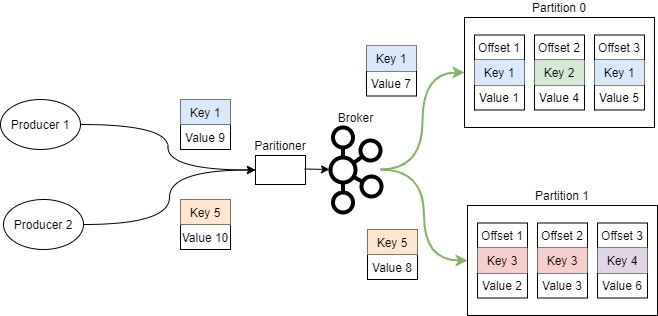
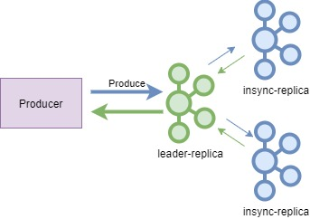

# Short Survey on Apache Kafka
This is a survey story about Apache Kafka. All phrases are quoted.

Kafka is a distributed, partitioned, replicated commit log service. It is a publish-subscribe messaging system designed to solve this problem. It is often described as a "distributed commit log" or more recently as a "distributing streaming platform". Kafka was traditionally seen as a powerful message bus, capable of delivering streams of events but without processing or transformation capabilities. Kafka's reliable stream delivery capabilities make it a perfect source of data for stream-processing systems.

## Topics and Partitions
Messages in Kafka are categorized into topics. Topics are additionally broken down into several partitions. Messages are written to it in an append-only fashion and are read in order from beginning to end. A topic typically has multiple partitions, there is no guarantee of message time-ordering across the entire topic, just within a single partition. Partitions are also the way that Kafka provides redundancy and scalability. Each message in a given partition has a unique offset.


## Create a Topic
There are 3 ways to create a Topic:
- **By command**: Kafka provides a command-line utility named Kafka-topics.sh to create topics on the server.

```shell
    $ /bin/kafka-topics.sh --create \
        --zookeeper <hostname>:<port> \
        --topic <topic-name> \
        --partitions <number-of-partitions> \
        --replication-factor <number-of-replicating-servers>
```
- **Automatic**: The "auto.create.topics.enable" property, when set to true, automatically creates topics when applications attempt to produce, consume, or fetch metadata for a nonexistent topic. We discuss it later.

- **By REST API**: According to the Confluent REST Proxy API Reference, the creation of a topic is possible with the REST Proxy API v3.

```Rest
    POST /clusters/{cluster_id}/topics HTTP/1.1
    Host: example.com
    Content-Type: application/json
    {
        "topic_name": "<topic-name>",
        "partitions_count": <number-of-partitions>,
        "replication_factor": <number-of-replicating-servers>,
        "configs": [
            {
                "name": "cleanup.policy",
                "value": "compact"
            },
            {
                "name": "compression.type",
                "value": "gzip"
            }
        ]
    }
```

## Describe a Topic
This will allow you to examine the specific configuration for a topic or client.
```shell
    $ /bin/kafka-configs.sh \
        --zookeeper <hostname>:<port> \
        --describe --entity-type topics \
        --entity-name <topic-name>
```

## Some Important Topic options
There are some important topic options:

### num.partitions
The num.partitions parameter determines how many partitions a new topic is created with, primarily when automatic topic creation is enabled.

### log.retention.ms
The amount of time after which messages may be deleted. There are log.retention.hours and log.retention.minutes but the recommended parameter to use is log.retention.ms.

### log.retention.bytes
Another way to expire messages is based on the total number of bytes of messages retained.

### Segment
A segment is simply a collection of messages of a partition. Instead of storing all the messages of a partition in a single file (think of the log file analogy again), Kafka splits them into chunks called segments. Kafka will close a log segment either when the size limit is reached or when the time limit is reached, whichever comes first. There are some important options for segment:

#### log.segment.bytes
Once the log segment has reached the size specified by the log.segment.bytes parameter, which defaults to 1 GB, the log segment is closed and a new one is opened.

#### log.segment.ms
specifies the amount of time after which a log segment should be closed. By default, there is no setting for "log.segment.ms", which results in only closing log segments by size.

## Brokers
A single Kafka server is called a **Broker**. Kafka brokers are designed to operate as part of a **Kafka Cluster** to maintain load balance. Kafka brokers are stateless, so they use ZooKeeper for maintaining their cluster state. The broker receives messages from producers, assigns offsets to them, and commits the messages to storage on disk. Kafka broker leader election can be done by ZooKeeper. Within a cluster of brokers, one broker will also function as the cluster **Controller**. The controller is responsible for administrative operations, including assigning partitions to brokers and monitoring for broker failures. partition is owned by a single broker in the cluster, and that broker is called the **Leader** of the partition. A partition may be assigned to multiple brokers, which will result in the partition being replicated to provide redundancy.

### Replication
It is the way Kafka guarantees availability and durability when individual nodes inevitably fail. Each topic is partitioned, and each partition can have multiple replicas. Each partition has one server which acts as the "**Leader**" and zero or more servers that act as "**Follower**" or in-sync replicas (ISR). All produce and consume requests go through the leader, to guarantee consistency. If the leader fails, one of the followers will automatically become the new leader. The replication mechanisms within the Kafka clusters are designed only to work within a single cluster, not between multiple clusters.


A replication factor of N allows you to lose N-1 brokers while still being able to read and write data to the topic reliably.

### Leader Election
When the leader for a partition is no longer available, one of the in-sync replicas will be chosen as the new leader. This leader election is "clean" in the sense that it guarantees no loss of committed data - by definition, committed data exists on all in-sync replicas.

1. Wait for a replica in the ISR to come back to life and choose this replica as the leader (hopefully it still has all its data). In this way, we lose availability.
2. Choose the first replica (not necessarily in the ISR) that comes back to life as the leader. In this way, we lose consistency.

### Some Important Broker options
There are some important Kafka broker options:

##### auto.create.topics.enable
The default Kafka configuration specifies that the broker should automatically create a topic under the following circumstances:

- When a producer starts writing messages to the topic
- When a consumer starts reading messages from the topic
- When any client requests metadata for the topic

##### log.dirs
Kafka persists all messages to disk, and these log segments are stored in the directories specified in the "**log.dirs**" configuration.

#### min.insync.replicas
When a producer sets acks to "all" (or "-1"), the "**min.insync.replicas**" specifies the minimum number of replicas that must acknowledge a write for the write to be considered successful. If this minimum cannot be met, then the producer will raise an exception. In this way, we may have to choose between availability and consistency.

##### default.replication.factor
Represents default replication factors for automatically created topics.

##### broker.rack
The placement of replicas is also very important. By default, Kafka will make sure each replica for a partition is on a separate broker. However, in some cases, this is not safe enough. If all replicas for a partition are placed on brokers that are on the same rack and the top-of-rack switch misbehaves, you will lose the availability of the partition regardless of the replication factor. To protect against rack-level misfortune, we recommend placing brokers in multiple racks and using the "**broker.rack**" broker configuration parameter to configure the rack name for each broker.

#### unclean.leader.election.enable
Indicates whether to enable replicas, not in the ISR set to be elected as a leader as the last resort, even though doing so may result in data loss. The default value is true.

## Producers
Producers publish messages into Kafka topics. By default, the producer does not care what partition a specific message is written to and will balance messages over all partitions of a topic evenly.
We start producing messages to Kafka by creating a ProducerRecord, which must include the topic we want to send the record to and a value. Optionally, we can also specify a key and/or a partition. Once we send the ProducerRecord, the first thing the producer will do is serialize the key and value objects to ByteArrays so they can be sent over the network.


Next, the data is sent to a partitioner. If we specified a partition in the ProducerRecord, the partitioner doesn't do anything and simply returns the partition we specified. If we didn't, the partitioner will choose a partition for us, usually based on the ProducerRecord key. Once a partition is selected, the producer knows which topic and partition the record will go to. It then adds the record to a batch of records that will also be sent to the same topic and partition. A separate thread is responsible for sending those batches of records to the appropriate Kafka brokers.

### Partitioner
Kafka messages are key-value pairs and while it is possible to create a ProducerRecord with just a topic and a value, with the key set to null by default partitioner chooses randomly a partition. 
But most applications produce records with keys. Keys serve two goals: they are additional information that gets stored with the message, and they are also used to decide which one of the topic partitions the message will be written to. So partition algorithm uses a formula which calculates modulo of the number of partitions, like:

```sudo code
Abs(Murmur2(keyBytes)) % numPartitions
```



This means that if a process is reading only a subset of the partitions in a topic, all the records for a single key will be read by the same process. If a key exists and the default partitioner is used, Kafka will hash the key (using its hash algorithm), and use the result to map the message to a specific partition. However, the moment you add new partitions to the topic, this is no longer guaranteed while new records will get written to a different partition.

### Sending Messages
There are three primary methods of sending messages:

1. **Fire-and-forget**: We send a message to the server and don't care if it arrives successfully or not. Most of the time, it will arrive successfully, since Kafka is highly available and the producer will retry sending messages automatically. However, some messages will get lost using this method.
2. **Synchronous send**: We send a message, the send() method returns a Future object, and we use get() to wait on the future and see if the send() was successful or not.
3. **Asynchronous send**: We call the send() method with a callback function, which gets triggered when it receives a response from the Kafka broker.

### Acknowledgments
The number of acknowledgments the producer requires the leader to have received before considering a request complete. This controls the durability of records that are sent. The following settings are common:

1. **acks=0**
The producer will not wait for a reply from the broker before assuming the message was sent successfully. No guarantee can be made that the server has received the record in this case, and the retries configuration will not take effect. The offset given back for each record will always be set to -1. this setting can be used to achieve very high throughput.
2. **acks=1**
The producer will receive a successful response from the broker the moment the leader replica received the message. In this case, the leader should fail immediately after acknowledging the record but before the followers have replicated it then the record will be lost. the producer will receive an error response and can retry sending the message, avoiding potential loss of data. If the client uses callbacks, latency will be hidden, but throughput will be limited by the number of in-flight messages.
3. **acks=all**
This means the leader will wait for the full set of in-sync replicas to acknowledge the record. This guarantees that the record will not be lost as long as at least one in-sync replica remains alive. This is the strongest available guarantee.



3. **Other acks settings**
Other settings such as acks=2 are also possible and will require the given number of acknowledgments but this is generally less useful.

### Messages and Batches
The unit of data within Kafka is called a message. For efficiency, messages are written into Kafka in batches. A batch is just a collection of messages, all of which are being produced to the same topic and partition. There are two options to manage batches:

1. **batch.size**
When multiple records are sent to the same partition, the producer will batch them together. Too small value will add some overhead and too large will not cause delays in sending messages.
2. **linger.ms**
controls the amount of time to wait for additional messages before sending the current batch.

### Idempotent Producer
While a message is sent by the producer to the broker but due to some issue acknowledgment does not come back to the producer. Producer retries and sends the same message again. The Broker sends an acknowledgment to the producer and writes the message again to the topic partition.


Idempotent delivery ensures that messages are delivered exactly once to a particular topic partition during the lifetime of a single producer. Transactional delivery allows producers to send data to multiple partitions such that either all messages are successfully delivered, or none of them are. Every new producer will be assigned a unique PID during initialization. For a given PID, sequence numbers will start from zero and be monotonically increasing, with one sequence number per topic partition produced. The sequence number will be incremented by the producer on every message sent to the broker. The broker maintains in memory the sequence numbers it receives for each topic partition from every PID. The broker will reject a produce request if its sequence number is not exactly one greater than the last committed message from that PID/TopicPartition pair. Messages with a lower sequence number result in a duplicate error, which can be ignored by the producer.


```C#
    new ProducerConfig
    {
        BootstrapServers = "<Bootstrap Servers>",
        ClientId = "<Client Id>",
        EnableIdempotence = true,
        Acks = Acks.All
    };
```

## Consumers
The consumer subscribes to one or more topics and reads the messages in the order in which they were produced. Before discussing the specifics of Apache Kafka Consumers, we need to understand the concept of publish-subscribe messaging, message queueing and theirs differences.

### Traditional Message Queuing
In a queue, a pool of consumers may read from a server and each message goes to one of them.


### Publish-Subscribe
Publish-Subscribe messaging is a pattern that is characterized by the sender (publisher) of a piece of data (message) not specifically directing it to a receiver. Instead, the publisher classifies the message somehow, and that receiver (subscriber) subscribes to receive certain classes of messages. Pub/Sub systems often have a broker, a central point where messages are published, to facilitate this.


Kafka offers a single consumer abstraction that generalizes both of these by the consumer group. Kafka consumers are typically part of a consumer group. When multiple consumers are subscribed to a topic and belong to the same consumer group, each consumer in the group will receive messages from a different subset of the partitions in the topic. Consumer instances can be in separate processes or on separate machines.

### Consumers in the same consumer group
If all the consumer instances have the same consumer group, then this works just like a traditional queue balancing load over the consumers. By storing the offset of the last consumed message for each partition, either in Zookeeper or in Kafka itself, a consumer can stop and restart without losing its place. When a consumer subscribes to a topic can be assigned to partitions by brokers as:

1. **Assigned to more than one partitions**: The number of consumers in the consumer group is less than the partitions. In this case, the brokers assign to some consumers more than one partitions.


2. **Assigned to exact one partition**: The number of consumers in the consumer group is equal to the partitions. In this case, the brokers will assign partitions to consumers one by one.


3. **Not Assigned to partition**: Consumers are more than partitions in a consumer group. In this case, brokers don't assign partitions to some consumers and those consumers will be Idle.


### Consumers in different consumer groups
If all the consumer instances have different consumer groups, then this works like publish-subscribe and all messages are broadcast to all consumers.


Just increasing the number of consumers won't increase the parallelism. You need to scale your partitions accordingly. To read data from a topic in parallel with two consumers, you create two partitions so that each consumer can read from its partition. Also since partitions of a topic can be on different brokers, two consumers of a topic can read the data from two different brokers.

### Message Delivery Semantics
1. At most once: Messages may be lost but are never redelivered.
2. At least once: Messages are never lost but may be redelivered.
3. Exactly once: this is what people want, each message is delivered once and only once.

### Some Important Consumer Options
There are some vital consumer options:
1. **auto.commit.enable**
This property enables a periodical commit of message offsets to the Zookeeper that is already fetched by the consumer. In the event of consumer failures, these committed offsets are used as a starting position by the new consumers.
2. **auto.commit.interval.ms**
This property defines the frequency (in milliseconds) for the consumed offsets to get committed to ZooKeeper.
3. **client.id**
This can be any string, and will be used by the brokers to identify messages sent from the client. It is used in logging and metrics, and for quotas.

## Reliability Guarantees
1. Kafka guarantees messages order in a partition.
2. Produced messages are considered "committed" when they were written to the partition on all its in-sync replicas (but not necessarily flushed to disk).
3. Messages that are committed will not be lost as long as at least one replica remains alive.
4. Consumers can only read messages that are committed.


## References
- Kafka: The Definitive Guide: Real-Time Data and Stream Processing at Scale  -  by Neha Narkhede, Gwen Shapira, Todd Palino
- Apache Kafka - Nishant Garg
- Learning Apache Kafka Second Edition - Nishant Garg
- Cloudera: Reference Guide for Deploying and Configuring Apache Kafka
- https://docs.confluent.io
- https://kafka.apache.org/081/documentation.html
- https://medium.com/@stephane.maarek/how-to-use-apache-kafka-to-transform-a-batch-pipeline-into-a-real-time-one-831b48a6ad85
- https://medium.com/@durgaswaroop/a-practical-introduction-to-kafka-storage-internals-d5b544f6925f
- https://www.confluent.io/blog/5-things-every-kafka-developer-should-know/
- https://docs.cloudera.com/HDPDocuments/HDP3/HDP-3.0.1/kafka-working-with-topics/content/creating_a_kafka_topic.html
- https://hevodata.com/blog/kafka-exactly-once-semantics/